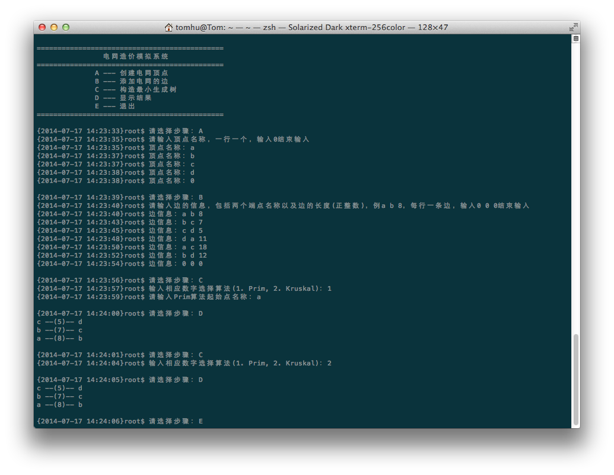

# 电网造价模拟系统

## 目录

- 项目概述
- 项目需求

## 项目概述

假设一个城市有n个小区，要实现n个小区之间的电网都能够相互接通，构造这个城市n个小区之间的电网，使总工程造价最低。请设计一个能够满足要求的造价方案。

## 功能需求

在每个小区之间都可以设置一条电网线路，都要付出相应的经济代价。n个小区之间最多可以有n（n-1）/2条线路，选择其中的n-1条使总的耗费最少。

经过分析，该问题本质上是一个求最小生成树的问题，在本程序中，我们使用Prim算法和Kruskal算法求解

#### 功能划分

- 处理程序流程
- 使用Prim算法或Kruskal算法求解问题

#### 功能描述

- 处理程序流程
	
	本程序有四个步骤：
	
	1. 输入电网顶点信息
	2. 输入电网边信息
	3. 运算求解
	4. 退出
	
	各步骤的执行有其前提条件：
	
	- ___步骤2___ 要求 ___步骤1___ 已执行
	- ___步骤3___ 要求 ___步骤1___ 和 ___步骤2___ 都已执行
	
	还有些需要注意的地方：
	
	- 在 ___步骤1___ 执行时，会清空掉此前已经存在的点集和边集，重新为电网添加顶点
	- 在 ___步骤2___ 执行时，会清空掉此前已经存在的边集，而不会清空点集
	- ___步骤3___ 执行时，需要选择算法，选择 ___Prim算法___ 时需要指定起始点

- 使用Prim算法求解

(未完成)

- 使用Kruskal算法求解

(未完成)

#### 用户界面

整个用户界面基于命令行，用户只需要根据提示并输入相应的信息即可使用本程序。

在用户进入程序的时候会显示欢迎信息及帮助信息。
